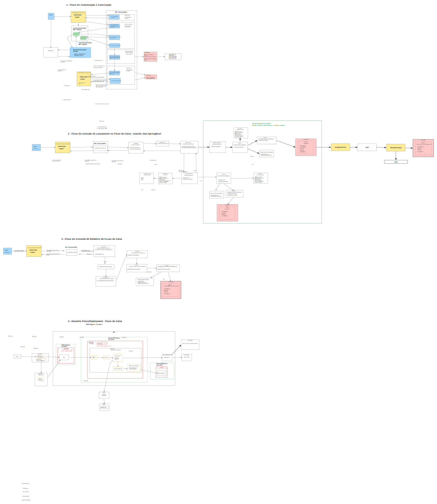

# Solução de Fluxo de Caixa

## O que entendi

Foi dito que um comerciante precisa controlar seu fluxo de caixa.

- Serviço que faça o controle de lançamentos.
  Um serviço de ledger imutável para garantir a consistência dos lançamentos by design.
- Serviço consolidado.
  Entendido como a consolidação das entradas e saídas do dia para saber se perdeu ou ganhou dinheiro.

## Mapeamento de Domínios Funcionais

À princípio, vêm à mente duas macrofunções:

- Ledger (livro razão).
  Seria o transacional imutável, com o analítico e o consolidado.
- Relatórios.
  Há uma dúvida se isso seria um domínio separado ou apenas consultas derivadas do domínio do ledger.

## Refinamento dos Requisitos

Como não houve espaço para perguntas adicionais, este racional assume alguns pressupostos.

Funcionalmente, para um comerciante conseguir controlar o fluxo diário de caixa por meio de uma solução de sistema, o mínimo necessário seria:

- Um ledger (livro razão) com os lançamentos, débitos e créditos.
- Uma interface para realizar os lançamentos.
- Um cadastro básico da empresa do comerciante para o livro razão.
- Verificar como antecipações de pagamentos afetam o fluxo de caixa.
- Relatórios para acompanhamento do fluxo, possivelmente em formato de dashboard com opção de impressão.

### Requisitos não funcionais

- Segurança.
  Autenticação, cadastro de novos usuários, login, recuperação de senha e autorização por perfil. Exemplo: o comerciante pode lançar e consultar relatórios; um funcionário pode apenas lançar.
- Performance.
  Uma consulta não pode ter `P95` maior que `800 ms` e `P99` maior que `1 s`. Deve suportar `100` usuários simultâneos.
- Usabilidade.
  Dashboard simples, com as funcionalidades principais em uma única tela. A aplicação é web, sem app nativo, então precisa ser responsiva para desktop, tablet e celular.
- Escalabilidade.
  Deve ser capaz de adicionar mais servidores, pods ou lambdas, aumentar o tamanho dos pods e crescer verticalmente na base de dados quando necessário.
- Disponibilidade.
  Deve estar disponível `99%` do tempo. Deploys sem indisponibilidade são desejáveis, mas manutenções maiores podem exigir uma janela planejada de até `30 minutos`.
- Manutenibilidade.
  O texto original do Word parece ter sido interrompido neste ponto: `Deve ter uma estrutura de código clara de ler, ser extensível e seguir p`.

## Desenho da Solução

### Linha de raciocínio

O raciocínio descrito no documento parte do número de usuários que a aplicação poderia suportar. Como o cenário pode variar entre um pequeno comerciante e uma rede nacional, foi considerado um pico de `50` requisições por segundo na consulta do consolidado diário.

Convertendo isso:

- `50` requisições por segundo
- `3000` requisições por minuto
- Assumindo `5` requisições por minuto por usuário
- Resultado aproximado: `600` usuários ativos simultâneos no horário de pico dessa funcionalidade

Nesse cenário, o documento considera que já se justifica uma arquitetura mais robusta.

A linha de decisão registrada foi:

- Considerar inicialmente `Next.js` no frontend e `Python` no backend
- Evoluir a decisão para uma stack mais enterprise
- Adotar `Angular` no frontend
- Adotar `Java + Spring Boot` no backend

Também foram registrados os seguintes direcionamentos arquiteturais:

- Uso de `BFF` no fluxo de autenticação e autorização
- Separação de responsabilidades inspirada em clean architecture
- Lançamentos tratados como eventos imutáveis em `Postgres`

## Diagrama Consolidado

Imagem gerada localmente a partir do arquivo Excalidraw do projeto:

